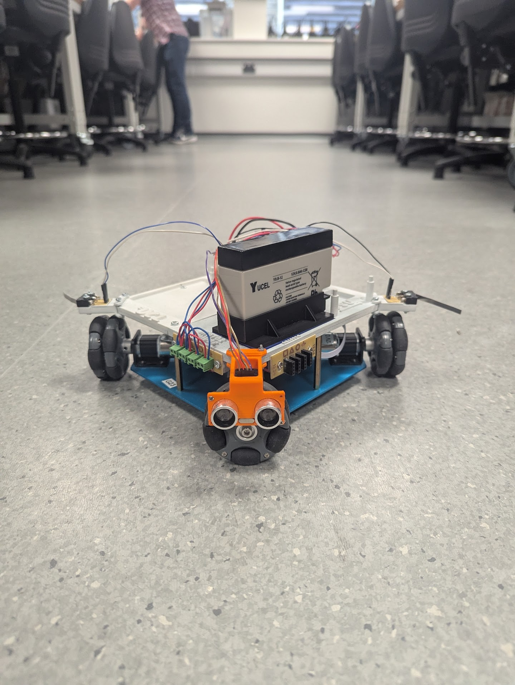

# Open Day Robots

Arduino material for Fleming Society's open day robot demo. Visitors get a
fully built two-motor robot with an ultrasonic distance sensor and two
buttons, and spend the session programming it to find its way through a
gap without hitting anything. A session takes about 2 to 2.5 hours.

## What's in the repo

| Path | What it is |
| --- | --- |
| [`firmware/template/template.ino`](firmware/template/template.ino) | Starter sketch. All the motor, button and sensor functions are written, but the main loop is empty for the visitor to fill in. |
| [`firmware/working/working.ino`](firmware/working/working.ino) | Reference sketch with the loop filled in. Use this to demo the finished behaviour or to check a visitor's attempt. |
| [`docs/`](docs/) | Slides used to explain the demo. |

## Hardware

The sketches assume:

- Two motors: one for forward/backward, one for left/right, each on its own
  analog speed pin and a digital direction pin.
- An HC-SR04 (or similar) ultrasonic sensor for distance.
- Two push buttons (left/right) wired with `INPUT_PULLUP`, used to tell the
  robot which side of a gap it's aiming for.

Pin numbers and speed/timing constants are set at the top of each sketch
and are meant to be tweaked to match whatever board is wired up on the day.

The chassis in the photo has four independently driven omni wheels, which
is more motors than the two-motor model the sketches describe. Either the
sketches were simplified for teaching and don't drive every wheel, or the
photo shows a later hardware revision the code hasn't caught up with.
Worth confirming and updating this section once someone checks the wiring
against the current sketches.

## Slides

`docs/` has two decks:

- `OPEN DAY ROBOTS.pdf` / `.pptx` is the current deck, last updated July
  2025. Use this one for a session unless you have a specific reason not
  to.
- `docs/legacy-2024/` holds Junzhe's 2024 deck (`open-day-robotics-demo-2024`).
  It takes a more technical angle and is kept for reference, not as the
  default slides to present from.

## Running a session

1. Open `firmware/template/template.ino` in the Arduino IDE.
2. Have a built robot ready and check the pin numbers at the top of the
   sketch match its wiring.
3. Let the visitor add code inside `loop()` using the provided functions
   (`moving_forward()`, `moving_backward()`, `moving_left()`,
   `moving_right()`, `button_state()`, `distance_measurement()`).
4. If you need to show what a working solution looks like, open
   `firmware/working/working.ino` instead.

## Status

The sketches were last updated June 2025. Nobody has recorded which board
and library versions they were tested against, so recompile and test on
the actual hardware before running a live session rather than assuming it
still works as-is.

## Licensing

The sketches in `firmware/` and the current slide deck
(`docs/OPEN DAY ROBOTS.pdf` / `.pptx`) are released under the MIT licence,
see [LICENSE](LICENSE). The legacy 2024 deck in `docs/legacy-2024/` is
someone else's work and is not covered by that licence, see
[NOTICE.md](NOTICE.md).
